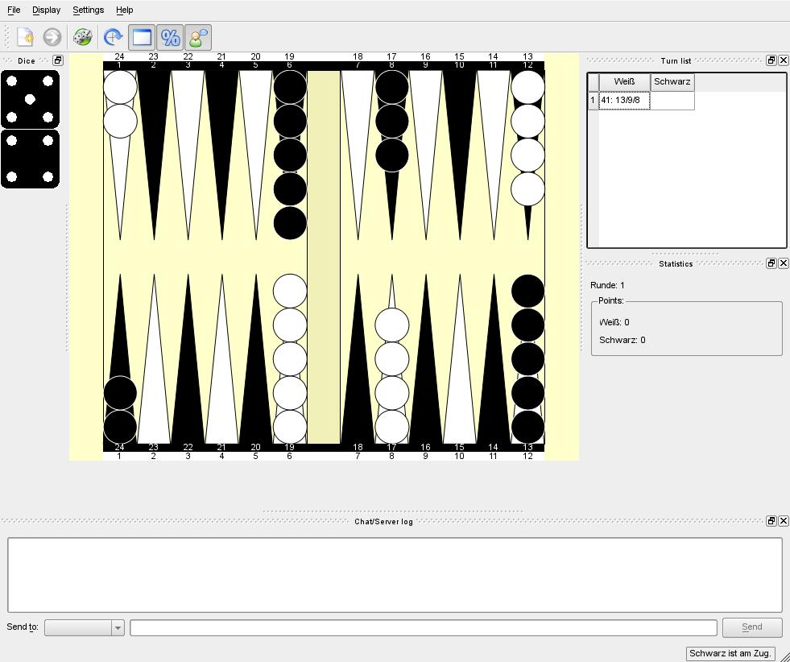

# Backgammon

A Backgammon game. You can either compete against a human opponent or the
computer. It is also possible to play over a network connection.

## Remarks

* Checkers are moved with drag&drop.
* The server for network games is configured with the `bgserver.conf` file.
* The path to the configuration file can be passed to the server on startup with
  the `--conffile <file>` option.

# Changelog

## Version 1.7

* Server assistant for an easier start of the server.
* Add missing English translations.

## Version 1.6

* Undo function.
* Fixed miscellaneous bugs.

# License

The game was released under the [GNU General Public License, version
2](//www.gnu.org/licenses/gpl-2.0.html).
